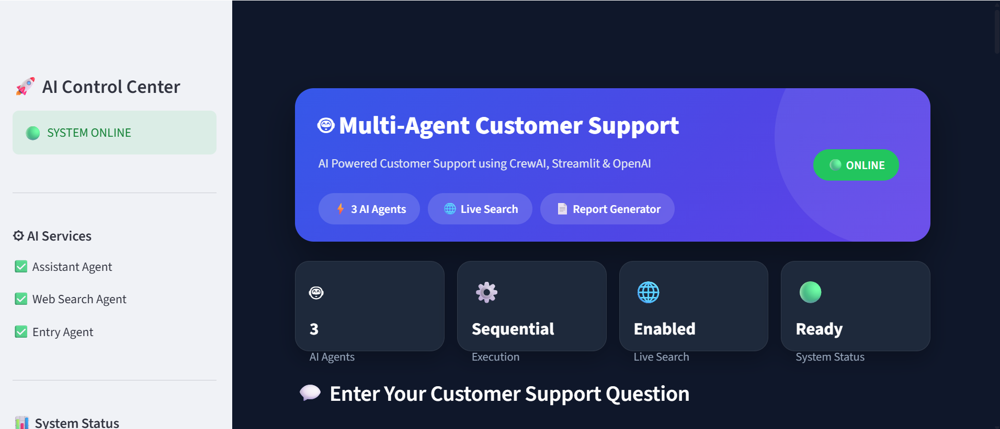

# 🤖 Multi-Agent Customer Support System

A modern AI-powered **Multi-Agent Customer Support System** built using **CrewAI**, **Streamlit**, **OpenAI GPT-4.1 Mini**, and **Serper Web Search**.

This project was developed as part of the **Gen AI Architect Weekly Buildathon**.

---

## 🚀 Features

- 🤖 Assistant Agent
  - Answers customer questions using AI knowledge.

- 🌐 Web Search Agent
  - Performs live internet searches using Serper API.
  - Generates responses from real-time information.

- 📝 Entry Agent
  - Creates a structured customer support report.
  - Automatically saves the report as `answers.txt`.

- 🎨 Premium Streamlit Dashboard
  - Animated workflow pipeline
  - Live execution terminal
  - Progress tracking
  - KPI dashboard
  - Glassmorphism UI
  - Download generated report

---

## 🏗 Architecture

```
                 User Query
                      │
                      ▼
          🤖 Assistant Agent
                      │
                      ▼
         🌐 Web Search Agent
                      │
                      ▼
            📝 Entry Agent
                      │
                      ▼
          answers.txt Report
                      │
                      ▼
             Streamlit Dashboard
```

---

## 🖥 Tech Stack

- Python 3.12+
- CrewAI
- CrewAI Tools
- Streamlit
- OpenAI GPT-4.1 Mini
- Serper API
- HTML & CSS

---

## 📂 Project Structure

```
buildathon-support-crew/

│── app.py
│── .env
│── answers.txt
│── README.md
│── requirements.txt
│── .gitignore
```

---

## ⚙ Installation

### Clone Repository

```bash
git clone https://github.com/yourusername/buildathon-support-crew.git

cd buildathon-support-crew
```

---

### Create Virtual Environment

```bash
python -m venv venv
```

---

### Activate

Windows

```bash
venv\Scripts\activate
```

Mac/Linux

```bash
source venv/bin/activate
```

---

### Install Packages

```bash
pip install -r requirements.txt
```

---

## 🔑 Environment Variables

Create a `.env` file.

```env
OPENAI_API_KEY=your_openai_api_key

SERPER_API_KEY=your_serper_api_key
```

---

## ▶ Run

```bash
streamlit run app.py
```

---

## 📸 Dashboard Features

- Premium Hero Banner
- AI Pipeline Visualization
- Animated Progress
- Live Execution Terminal
- Agent Status Tracking
- AI Response Cards
- Download Report

---
## Screenshot 



## 📄 Output

After execution, the application generates

```
answers.txt
```

containing

- Customer Question
- Assistant Response
- Web Search Response
- Final Report

---

## 👨‍💻 Author

Developed for the **Gen AI Architect Weekly Buildathon**

Built with ❤️ using CrewAI & Streamlit.